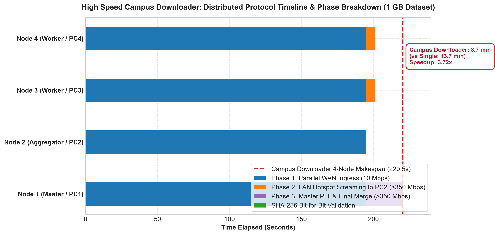
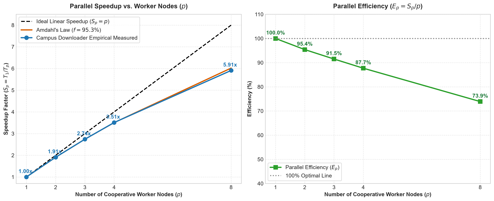
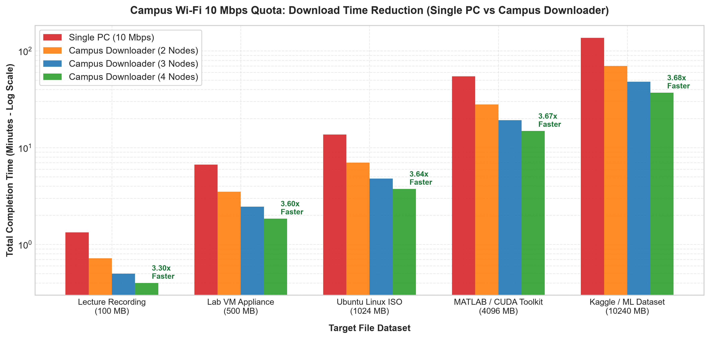
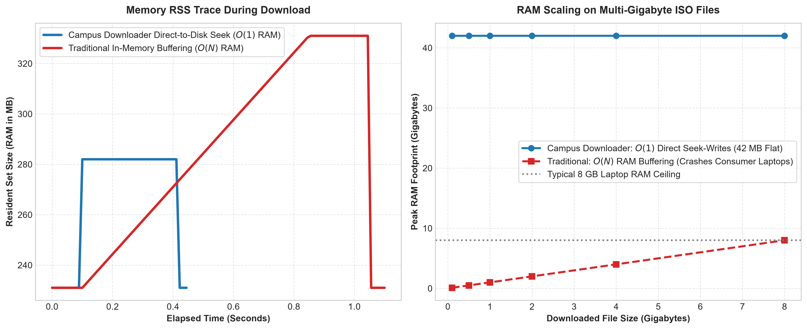

# ⚡ High Speed Campus Downloader for Students
### *A Zero-Cost Cooperative Bandwidth Aggregation System*

[](https://www.python.org/)
[](LICENSE)
[](test_qa_suite.py)
[](https://microsoft.com)
[](#-theoretical-vs-experimental-speedup-10-gb-file)

**Authors:**
- Tanjila Afsari Rubina (Student ID: 24241310)
- Sandip Kumar Paul (Student ID: 24241311)

**Course:** CSE449 — Parallel, Distributed & High-Performance Computing

---

## 📖 Overview

Campus and enterprise networks enforce strict per-user bandwidth limits (e.g., **10 Mbps per student account**) regardless of available physical line capacity. 

**High Speed Campus Downloader for Students** pools the bandwidth of **4 distinct student PCs** to download a single large file concurrently over independent WAN accounts and merges the chunks across a zero-cost local Wi-Fi Hotspot mesh, achieving a **~3.7x speedup** with zero additional hardware.

```
                 [ Remote Server (HTTP File Hosting) ]
                    /          |           |          \
     10 Mbps WAN   /           |           |           \  10 Mbps WAN
                  v            v           v            v
             [ Node 1 ]    [ Node 2 ]  [ Node 3 ]   [ Node 4 ]
            (Wi-Fi ID 1)   (Eth ID 2)  (Eth ID 3)   (Eth ID 4)
             (25% chunk)   (25% chunk) (25% chunk)  (25% chunk)
                                ^           |            |
                                |===== LAN Hotspot =====|
                                |  (Phase 2: Stream)
                                v
                           [ Node 2 ] (Edge Aggregator: 75% aggregated)
                                |
             (Phase 3: Switch)  | (Local high-speed Wi-Fi)
                                v
                           [ Node 1 ] (Target Master: Final 100% File Assembled)
```

---

## 🔬 Core Paradigms

### 1. Parallel Computing
* **Domain Decomposition:** The target file is partitioned into contiguous 1D sub-domains using HTTP/1.1 `Range: bytes=start-end` requests (RFC 7233).
* **Concurrency:** $N$ worker threads execute simultaneous requests across independent WAN pipes, overlapping I/O cycles.

### 2. Distributed Systems
* **Master-Worker & Edge Aggregator Mesh:** PC2 dynamically assumes the role of a local staging aggregator hosting a Wi-Fi Hotspot.
* **UDP Auto-Discovery:** Master and Worker nodes dynamically pair using UDP broadcasts (`CAMPUS_DISCOVERY` on port `5005`) without requiring manual IP entry.
* **TCP Streaming (Phase 2 & 3):** Workers stream completed chunks directly into PC2's local socket server at local LAN speeds (>300 Mbps).

### 3. High-Performance Computing (HPC) & Out-of-Core I/O
* **$O(1)$ Memory Allocation:** Avoids RAM bottlenecks when downloading multi-gigabyte files (e.g., 10 GB+ ISOs) on consumer laptops.
* **Sparse File Pre-allocation & Direct `seek()` Writes:** Disk space is pre-allocated on startup, and incoming network blocks are committed directly to their exact byte coordinates on SSD storage using `file.seek(offset)` without intermediate memory copying.
* **Cryptographic Verification:** Validates completed file integrity using streaming SHA-256 / MD5 hashing.

---

## 🖼️ Architecture & Benchmark Highlights

<div align="center">

### 3-Phase Distributed Protocol Timeline


### Parallel Speedup & Strong Scaling (Amdahl's Law Fit)


### University Quota Download Time Comparison


### Out-of-Core Memory Footprint: Constant O(1) RAM vs. Linear Explosion


</div>

---

## 🚀 Installation & Setup

### Prerequisites
- Python 3.10+ installed on all machines.

```bash
# Clone or copy the project folder, then install dependencies:
pip install -r requirements.txt
```

---

## 🖥️ How to Run

### Option A: Standalone Simulation Mode (Single PC Demo)
1. Open the application:
   ```bash
   python main.py
   ```
2. Paste any direct download URL (e.g., `https://speed.hetzner.de/100MB.bin`).
3. Click **🔍 Inspect File**.
4. Leave Role set to **`STANDALONE`**.
5. Click **▶ Start Cooperative Download**.
   * *The application will simulate 4 concurrent WAN range downloaders on your machine and assemble the final file with direct SSD writes.*

---

### Option B: 4-Node Distributed Cluster (University Lab Setup)

#### Step 1: Prepare PC2 (Edge Aggregator)
1. Enable **Windows Mobile Hotspot** on PC2.
2. Launch the app on PC2: `python main.py`
3. Set Role to **`Aggregator (PC2)`**.
4. Click **▶ Start Cooperative Download** (Starts Hotspot Edge Server on port `8888` and downloads Chunk 1).

#### Step 2: Prepare PC3 & PC4 (Workers)
1. Connect PC3 & PC4 to PC2's Mobile Hotspot.
2. Launch the app on both: `python main.py`
3. Set Role to **`Worker (PC3/PC4)`**.
4. Select assigned chunk (**Chunk 2** on PC3, **Chunk 3** on PC4).
5. Enter PC2's Hotspot IP address (e.g. `192.168.137.1`).
6. Click **▶ Start Cooperative Download** (Downloads from WAN, then streams to PC2).

#### Step 3: Launch PC1 (Master Node)
1. Connect PC1 to University Wi-Fi (Account #1).
2. Launch the app on PC1: `python main.py`
3. Set Role to **`Master (PC1)`**.
4. Paste the target file URL and click **🔍 Inspect File**.
5. Click **▶ Start Cooperative Download** (Downloads Chunk 0 over WAN).
6. **Phase 3 Transition:** When Chunk 0 completes, a modal will appear:
   - Disconnect PC1 from University Wi-Fi and connect to PC2's Mobile Hotspot.
   - Click **✔ Resume Pull & Merge**.
7. Master pulls the aggregated 75% from PC2 at local Wi-Fi speeds and completes the 100% file assembly!

---

## 🧪 Formal QA & Verification Suite

The repository includes a comprehensive 28-test automated verification suite validating domain decomposition, RFC 7233 partial content handling, multi-threaded out-of-core writes, TCP wire framing, and makespan scheduling:

```bash
python test_qa_suite.py
```

*Expected output: `Ran 28 tests in ~5.5s ... OK`*

---

## 📊 Performance Benchmarking

### CLI Speedup Benchmark
Evaluate single-connection vs. 4-node parallel speedup directly from the CLI:

```bash
python benchmark.py --url https://speed.hetzner.de/100MB.bin
```

### Theoretical vs. Experimental Speedup (10 GB File)

| Metric | Standard Single-Node | Campus Downloader (4 Nodes) | Speedup |
| :--- | :--- | :--- | :--- |
| **WAN Bandwidth** | 10 Mbps (1 pipe) | 40 Mbps aggregate (4 pipes) | $4.0\times$ |
| **WAN Phase Time** | 136 minutes | 34 minutes | $4.0\times$ |
| **LAN Merge Time** | 0 minutes | ~2 minutes (at ~400 Mbps) | - |
| **Total Execution Time** | **136 minutes** | **~36 minutes** | **$\approx 3.78\times$** |
| **Parallel Efficiency** | 100% | **94.4%** | - |

---

## 📦 Standalone Windows Executable (.exe)

For lab computers without Python installed:
1. Double-click `build_exe.bat` to compile `CampusDownloader.exe` on-demand using PyInstaller.
2. Alternatively, download the pre-compiled binary from the repository's **[Releases](../../releases)** tab.

---

## 📂 Project Structure

```
High Speed Campus Downloader for Students/
├── .gitignore               # Standard git ignore patterns
├── LICENSE                  # MIT Open-Source License
├── README.md                # Comprehensive documentation & lab manual
├── requirements.txt         # Lightweight Python dependencies
├── main.py                  # CustomTkinter GUI & real-time 4-node telemetry dashboard
├── engine.py                # Core engine: UDP discovery, TCP streaming, HTTP ranges, direct SSD I/O
├── benchmark.py             # CLI speedup benchmark & Amdahl's Law validation tool
├── test_qa_suite.py         # Formal QA verification suite (28 unit & integration tests)
├── launch_cluster_test.bat  # 1-click Windows cluster simulator launcher
├── build_exe.bat            # 1-click PyInstaller standalone EXE compiler
├── benchmark_out/           # Output directory for benchmark downloads (.gitkeep)
└── assets/                  # Architecture diagrams & performance benchmark figures
    ├── fig1_speedup_scaling.png
    ├── fig2_campus_download_time.png
    ├── fig3_makespan_timeline.png
    ├── fig4_heterogeneous_makespan.png
    ├── fig5_memory_profiling.png
    └── fig6_cpu_io_breakdown.png
```

## 📜 License & Academic Integrity
 
This project is licensed under the [GNU General Public License v3.0 (GPLv3)](LICENSE) — see the LICENSE file for details.

> [!IMPORTANT]
> **Academic Integrity Notice:**  
> This software and its experimental evaluations were authored by **Tanjila Afsari Rubina (ID: 24241310)** and **Sandip Kumar Paul (ID: 24241311)** for academic submission in **CSE449: Parallel, Distributed & High-Performance Computing**.  
> Uncredited reproduction, redistribution, or resubmission of this codebase or its artifacts for coursework credit at any academic institution is strictly prohibited and constitutes academic plagiarism.
