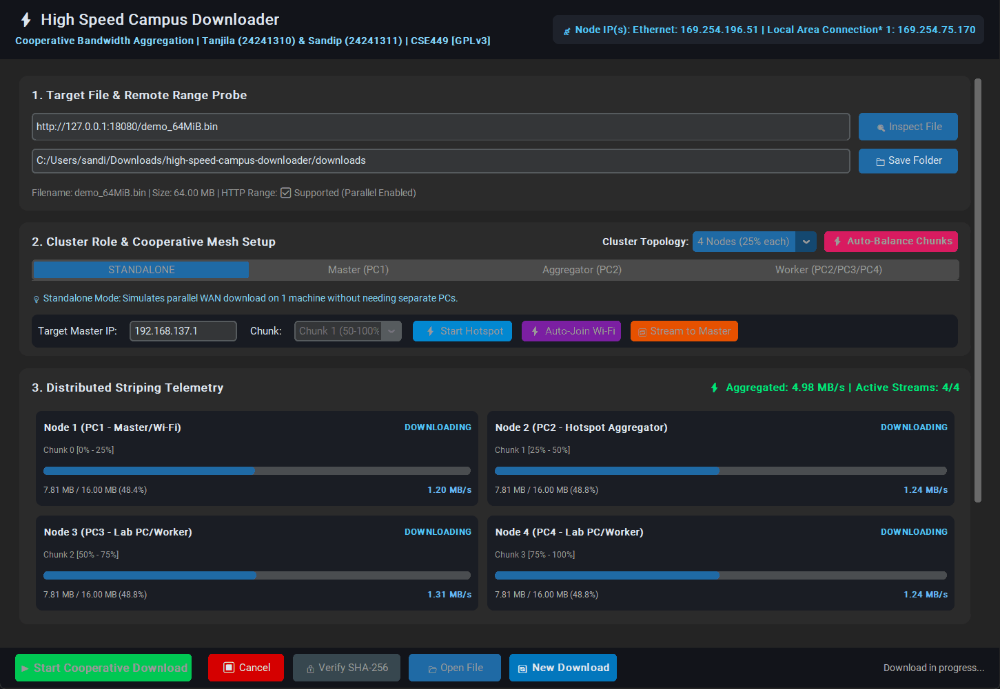
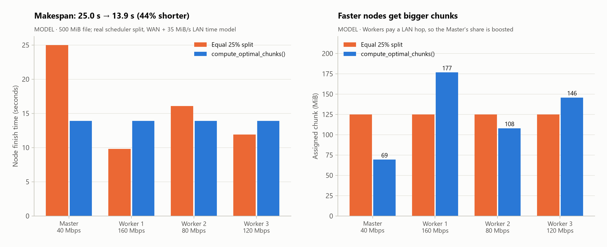
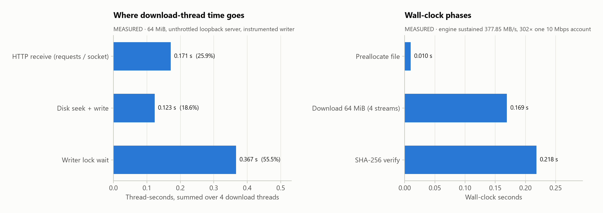

# ⚡ High Speed Campus Downloader for Students
### *A Zero-Cost Cooperative Bandwidth Aggregation System*

[](https://github.com/tanjilaafsarirubina/high-speed-campus-downloader/actions/workflows/ci.yml)
[](https://www.python.org/)
[](LICENSE)
[](#known-limitations)

**Authors:**
- Tanjila Afsari Rubina (Student ID: 24241310)
- Sandip Kumar Paul (Student ID: 24241311)

**Course:** CSE449 — Parallel, Distributed & High-Performance Computing

Campus networks cap each student account (say **10 Mbps**) no matter how fast the building's line is.
This app lets several students pool their accounts. The file is split into HTTP byte ranges, and each PC
downloads its range over its own account. The Workers then stream their chunks to one Master PC over a
local Wi-Fi hotspot. The Master writes every chunk straight to its offset in one preallocated file and
checks the result with SHA-256.



*The real GUI mid-download in Standalone mode (4 streams). The file comes from a local test server that
caps each connection at 10 Mbps, the way a campus proxy caps an account.*

---

## Results at a glance

Every number below is regenerated by [`benchmark_suite.py`](benchmark_suite.py) and stored in
[`assets/benchmark_results.json`](assets/benchmark_results.json). **Measured** means a real run of
[`engine.py`](engine.py) on one PC against a local test server; **model** means closed-form arithmetic
with the assumptions stated.

| Question | Answer | Kind |
| :--- | :--- | :--- |
| Does the engine turn *N* capped pipes into *N*× throughput? | **3.98×** with 4 streams, **7.78×** with 8 (8 MiB, each connection capped at 10 Mbps, median of 3 runs) | Measured |
| End-to-end speedup of 4 PCs over 1 on a 10 Mbps campus quota | **3.30×** for 100 MiB, **3.64×** for 1 GiB, **3.68×** for 10 GiB (2 h 16 min → 37 min) | Model |
| Why not 4×? | The Workers' chunks still have to cross the hotspot (350 Mbps assumed), plus 2.5 s of fixed overhead | Model |
| Memory while downloading 128 MiB | **+0.5 MiB** peak RSS with direct seek-writes vs. **+131 MiB** when buffering the file in RAM | Measured |
| Uneven node speeds (40/160/80/120 Mbps), 500 MiB | Makespan **25.0 s → 13.9 s** (44% shorter) with `compute_optimal_chunks()` vs. an equal 25% split | Model (real scheduler output) |
| Where the engine spends download-thread time | **55%** waiting on the single file-writer lock, 26% receiving HTTP, 19% writing to disk (64 MiB, unthrottled loopback) | Measured |
| Do the distributed modes assemble a correct file? | Yes: Master + 1 Worker (Auto-Balance), Master + 3 Workers, and Master + 3 Workers with Auto-Balance all reproduce the source file's SHA-256 | Measured ([`tools/cluster_e2e.py`](tools/cluster_e2e.py), in CI) |

**What has not been measured:** a real multi-PC run on a campus network. The ~3.7× figure is the model's
prediction for large files. On one machine, the per-connection cap stands in for "one account per PC".

---

## How it works

```
                  [ File server with HTTP/1.1 Range support (RFC 7233) ]
                  /                |                |                 \
       10 Mbps   /       10 Mbps   |      10 Mbps   |      10 Mbps     \      Phase 1 (WAN): each PC fetches
                v                  v                v                  v     its byte range on its own account
        [ PC1 Master ]     [ PC2 Worker ]    [ PC3 Worker ]     [ PC4 Worker ]
               ^                   |                |                  |
               |                   +----------------+------------------+     Phase 2 (LAN): Workers stream
               +-------- TCP :8888 over the Windows Mobile Hotspot ----+     their chunk to the Master

        Master: each chunk is written at its byte offset in one preallocated file, then SHA-256 verified
```

**Parallel computing**
* **Domain decomposition.** `split_uniform()` cuts the byte range into contiguous chunks, and each chunk
  is fetched with `Range: bytes=start-end`. If a server ignores the range and answers `200` instead of
  `206`, every chunk after the first is rejected, so a whole file never gets written at a chunk's offset.
* **Makespan-optimal splitting.** Workers pay an extra LAN hop, so a Worker with WAN speed $B_i$ has
  effective speed $B_i^* = \frac{B_i R_{LAN}}{B_i + R_{LAN}}$. Giving node *i* the share
  $S_i = S \cdot B_i^* / \sum_j B_j^*$ makes all nodes finish together (`compute_optimal_chunks()`).

**Distributed systems**
* **Control plane (TCP 5000).** With **Auto-Balance**, each Worker measures its WAN speed and reports it to
  the Master. A `CapacityBarrier` holds every Worker's connection until all have reported, then answers
  all of them from one split.
* **Data plane (TCP 8888).** Each chunk travels as a 12-byte magic token (`CAMPUS_DL_V1`), a 4-byte
  length, a JSON header and the raw bytes. The Master replies `OK` only if the byte count matches.
  `recv_exact()` reassembles TCP fragments.
* **Discovery (UDP 5005).** A Worker answers `EDGEMESH_DISCOVERY` probes with `EDGEMESH_WORKER`.

**HPC / out-of-core I/O**
* The destination file is preallocated once, and every 64 KB network buffer is written at its exact
  offset under a lock. Memory therefore stays flat regardless of file size (figure 5). Retries resume
  from the last byte written.
* A streaming SHA-256 (1 MB blocks) fingerprints the assembled file.

---

## Installation

**Windows, no Python needed:** download `CampusDownloader.exe` from the
[latest release](https://github.com/tanjilaafsarirubina/high-speed-campus-downloader/releases/latest) and
run it. It isn't code-signed, so SmartScreen may ask you to click *More info → Run anyway*.

**From source:** Python 3.10+ on every PC.

```bash
pip install -r requirements.txt
```

`requirements-bench.txt` adds `matplotlib` and `numpy` for the figure-generating benchmark suite.
To build the `.exe` yourself, `pip install pyinstaller` (ideally inside a `.venv`) and run `build_exe.bat`.

---

## How to run

### Option A: Standalone mode (one PC)

1. `python main.py`
2. Keep the default URL (`https://fsn1-speed.hetzner.com/100MB.bin`) or paste any direct link to a
   server that supports ranges, then click **🔍 Inspect File**.
3. Leave the role on **`STANDALONE`**, pick **2** or **4 Nodes**, and click **▶ Start Cooperative Download**.

Standalone mode downloads the chunks over parallel connections from one machine. That only speeds things
up when the server or proxy caps **each connection** (as in the screenshot). A cap on your **account**
needs more PCs.

### Option B: Multi-PC cluster (2 or 4 PCs)

1. **Hotspot.** On one PC, turn on *Windows Mobile Hotspot* (Settings → Network & internet → Mobile
   hotspot). The **⚡ Start Hotspot** button switches it on but doesn't change its name or password. For
   **⚡ Auto-Join Wi-Fi** to work, name it `CampusMesh` with password `EdgeMesh2026`.
2. **Every PC:** run `python main.py`, paste the same URL, choose the same **Cluster Topology**
   (2 or 4 nodes), and click **🔍 Inspect File**.
3. **Roles:** PC1 picks **`Master (PC1)`**. Every other PC picks **`Worker (PC2/PC3/PC4)`**, a chunk
   (**1**, or **1–3** on 4 nodes) and the Master's IP. Find that IP with `ipconfig`: hotspot clients get
   `192.168.137.x`, and the PC hosting the hotspot is `192.168.137.1`.
4. **Optional, Auto-Balance:** while every PC can reach the Master, click **⚡ Auto-Balance Chunks** on
   the Master first, then on every Worker within 60 s. The Master answers once all Workers have
   reported, and each Worker's chunk box then shows its assigned share.
5. **Start:** click **▶ Start Cooperative Download** on the Master, then on the Workers. The Master
   downloads chunk 0 on its own campus connection and listens on TCP 8888. Each Worker downloads its
   range, then streams it to the Master (10 connection attempts).
6. **Network switch:** when the Master's own chunk finishes, a dialog asks it to join the hotspot. Once
   it has, any Worker that gave up can click **🔁 Stream to Master**, after updating the IP if it changed.
7. The Master finishes when every chunk has arrived. **🔒 Verify SHA-256** prints the checksum, which you
   can compare with the one the download site publishes.

The **`Aggregator (PC2)`** role, which relays Workers' chunks to the Master, is not finished yet. See
[Known limitations](#known-limitations).

---

## Tests

```bash
python test_qa_suite.py                        # 31 unit & integration tests, ~6 s
python tools/cluster_e2e.py --nodes 4 --balance    # real GUI processes: Master + 3 Workers on 127.0.0.1
```

The unit tests exercise the engine directly: decomposition invariants, preallocation and non-destructive
reopening, concurrent writes, TCP framing under fragmentation, the chunk-streaming protocol, HTTP 206
handling, auto-resume after a dropped connection, the makespan scheduler, the control-plane round trip,
the Auto-Balance barrier and the UDP discovery beacon.

`tools/cluster_e2e.py` starts a throttled local server and launches one GUI process per node. It clicks
through the workflow above and fails unless the Master's file matches the source's SHA-256. It needs a
display (run it under `xvfb-run -a` on headless Linux) and the app's ports 5000, 8888 and 5005.

[CI](.github/workflows/ci.yml) runs lint, the unit tests, the CLI benchmark and a GUI smoke test on
Ubuntu and Windows (Python 3.10 and 3.13). It also runs all three cluster scenarios on both OSes, then
runs the benchmark suite and uploads the regenerated figures as an artifact.

---

## Benchmarks

```bash
python benchmark.py --url https://fsn1-speed.hetzner.com/100MB.bin   # 1 connection vs. 4 against a real server
python benchmark.py --mock                                           # same, against a local mock server
pip install -r requirements-bench.txt
python benchmark_suite.py                                            # regenerates everything in assets/ (~1 min)
```

`benchmark.py` checks that the 4-stream file is bit-identical to the single-stream one. Its speedup only
means something against a server that caps each connection. On the unthrottled `--mock` server there is
no bandwidth to pool, so expect about 1× or less.

### Figures

<div align="center">







</div>

Each figure's subtitle says whether it is **MEASURED** or **MODEL**. Loopback throughput varies from run
to run: 68–378 MiB/s across runs on the same laptop, versus 1.25 MiB/s for one 10 Mbps account.

---

## Known limitations

* **No multi-PC campus measurement yet.** The 3.3–3.7× end-to-end numbers come from the model. The
  measured results use one PC and a local server.
* **The Aggregator relay (the original "Phase 3") is not implemented.** The `Aggregator (PC2)` role
  downloads chunk 1 and collects Workers' chunks, but never forwards them to the Master. Point Workers
  (including PC2) directly at the Master instead.
* **The hotspot is not configured by the app.** The Wi-Fi automation uses PowerShell and `netsh`, so it
  is Windows-only. It also assumes the hotspot is named `CampusMesh` with password `EdgeMesh2026`.
* **Discovery is half-wired.** Workers answer UDP beacons, but the GUI's Master never broadcasts, so
  IPs are typed in.
* **The LAN protocol has no authentication or encryption.** The magic token only filters stray
  connections. Anyone on the hotspot can send the Master bytes that land within the file's bounds, and
  the Master trusts the chunk sizes Workers report. Compare the SHA-256 against a published checksum.
* **One writer lock serializes all streams.** On loopback, lock waits are 55–72% of download-thread
  time. That is irrelevant at 10 Mbps, but it is the first thing to change for faster links (for example
  per-thread `os.pwrite`).

---

## Project structure

```
high-speed-campus-downloader/
├── main.py                  # CustomTkinter GUI: roles, Auto-Balance, telemetry dashboard
├── engine.py                # Core engine: HTTP ranges, scheduler, control/data planes, direct disk I/O
├── test_qa_suite.py         # 31 unit & integration tests (unittest)
├── tools/cluster_e2e.py     # End-to-end test: Master + Worker GUI processes on one machine
├── benchmark.py             # CLI: 1 vs. N connections against a URL or local mock, with SHA-256 check
├── benchmark_suite.py       # Measured + modeled experiments; writes the figures and results in assets/
├── assets/                  # README figures, GUI screenshot, benchmark_results.json, benchmark_summary.csv
├── requirements.txt         # App dependencies
├── requirements-bench.txt   # + matplotlib, numpy for benchmark_suite.py
├── build_exe.bat            # PyInstaller one-file Windows build (dist/CampusDownloader.exe)
├── launch_cluster_test.bat  # Opens the GUI and lists the benchmark/test commands
├── .github/workflows/ci.yml # Lint, tests, cluster e2e, GUI smoke test, benchmark suite
├── CITATION.cff             # Citation metadata ("Cite this repository")
└── LICENSE                  # GNU GPLv3 (unmodified text)
```

## 📜 License & Academic Integrity

Copyright (C) 2026 Tanjila Afsari Rubina & Sandip Kumar Paul.

This project is free software under the [GNU General Public License v3.0](LICENSE), version 3 or (at your
option) any later version. It comes with ABSOLUTELY NO WARRANTY; see the LICENSE file for details.

> [!IMPORTANT]
> **Academic Integrity Notice:**  
> This software and its experimental evaluations were authored by **Tanjila Afsari Rubina (ID: 24241310)** and **Sandip Kumar Paul (ID: 24241311)** for academic submission in **CSE449: Parallel, Distributed & High-Performance Computing**.  
> Uncredited reproduction, redistribution, or resubmission of this codebase or its artifacts for coursework credit at any academic institution is strictly prohibited and constitutes academic plagiarism.
